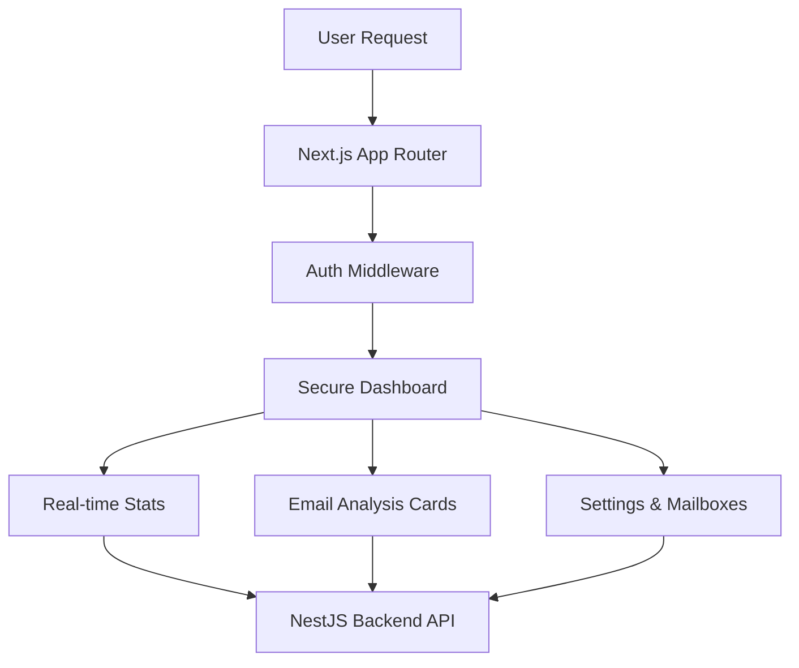

# SecureMail-Frontend 🖥️

> A Cinematic Security Operations Center (SOC) dashboard — making complex email threat data intuitive and actionable through a living, animated UI.

---

## 📋 Table of Contents

- [Design Philosophy](#-design-philosophy)
- [Key Dashboards](#-key-dashboards)
- [Quick Start](#-quick-start)
- [Configuration](#️-configuration)
- [Tech Stack](#-tech-stack)

---

## 🎨 Design Philosophy

The Frontend is built around a **"Cinematic SOC"** concept — using Framer Motion and Tailwind CSS 4 to create a UI that visually pulses with service health and animates the full lifecycle of email threats in real time.



---

## 🔍 Key Dashboards

**Mailbox Explorer** — A high-speed interface for browsing emails with real-time security score overlays displayed per message.

**Threat Simulation** — Cinematic animations that visualize the full "Decision Path" the security pipeline took for any specific email, stage by stage.

**Service Intel** — A live status board showing the health of the entire gRPC microservice ecosystem (AI, Malware, Backend).

---

## 🚀 Quick Start

### Option A — Via Root Setup Script (Recommended)

From the root `Securemail/` folder:

```bash
./setup.sh      # Mac/Linux
setup.bat       # Windows
```

The frontend will be available at **http://localhost:3001** once all services are healthy.

---

### Option B — Via Turborepo

```bash
# From root
pnpm dev:ui
```

---

### Option C — Manual Execution

Requires Node.js v22+ and pnpm.

```bash
# 1. Install dependencies
pnpm install

# 2. Create env file
cp .env.docker.example .env.local

# 3. Run in development mode
pnpm dev
```

---

## ⚙️ Configuration

Copy the example file:

```bash
cp .env.docker.example .env.docker
```

| Variable | Required | Description |
|---|---|---|
| `NEXT_PUBLIC_API_URL` | ✅ Yes | Backend URL — always `http://localhost:3000` for local dev |
| `PORT` | No | Frontend port (default: `3001`) |
| `HOSTNAME` | No | Bind address (default: `0.0.0.0`) |

> **Important:** `NEXT_PUBLIC_API_URL` is baked into the JS bundle at **build time**. If you change it, you must rebuild the Docker image.

---

## 🛠️ Tech Stack

| Layer | Technology |
|---|---|
| **Framework** | Next.js 16 (App Router) |
| **Runtime** | React 19 (Server Components) |
| **Styling** | Tailwind CSS v4 + Lucide Icons |
| **Animation** | Framer Motion |
| **Data Fetching** | React Query v5 |
| **Port** | `3001` |

---

## ⚠️ Troubleshooting

### Blank page or API errors

Make sure the Backend is running and healthy:

```bash
curl http://localhost:3000/health
```

### `NEXT_PUBLIC_API_URL` changes not taking effect

This variable is baked in at build time. After changing it, rebuild:

```bash
docker compose up --build frontend
```

### View frontend logs

```bash
docker compose logs -f frontend
```
