# SecureMail-Backend 🛡️

> The orchestration heart of the SecureMail ecosystem — a high-concurrency NestJS application implementing a **10-Stage Security Pipeline** that processes every email from ingestion to a final human-readable threat report.

---

## 📋 Table of Contents

- [How the Security Pipeline Works](#how-the-security-pipeline-works)
- [Quick Start - Run with One Command](#quick-start---run-with-one-command)
- [What Does the Setup Script Do?](#what-does-the-setup-script-do)
- [Getting Your Secrets](#getting-your-secrets)
- [Local Development (No Docker)](#%EF%B8%8Flocal-development-no-docker)
- [Project Structure](#project-structure)
- [Troubleshooting](#%EF%B8%8Ftroubleshooting)

---

## 🔍How the Security Pipeline Works

Every incoming email passes through **10 sequential stages** before a final verdict is issued:

```mermaid
graph LR
    A[Ingestion: IMAP/API] --> B[1. Email Parser]
    B --> C[2. Auth & SPF/DKIM]
    C --> D[3. Global Reputation]
    D --> E[4. Behavioral Map]
    E --> F[5. URL Sandboxing]
    F --> G[6. Malware Scanner]
    G --> H[7. Heuristic Scoring]
    H --> I[8. AI Reasoning Agent]
    I --> J[9. Decision Matrix]
    J --> K[Final Verdict & DB]
```



| Stage | What it does |
|---|---|
| **1. Email Parser** | Parses raw email headers, body, and attachments |
| **2. Auth & SPF/DKIM** | Validates SPF, DKIM, and DMARC to prevent spoofing |
| **3. Global Reputation** | Checks sender IP/domain against threat intelligence feeds |
| **4. Behavioral Map** | Tracks sender patterns and mailbox communication history |
| **5. URL Sandboxing** | Extracts and tests all URLs found in the email |
| **6. Malware Scanner** | Offloads attachment scanning to the Go microservice via gRPC |
| **7. Heuristic Scoring** | Runs 28+ targeted rules (homoglyph attacks, credit card theft, etc.) |
| **8. AI Reasoning Agent** | Offloads LLM reasoning to the Python microservice via gRPC |
| **9. Decision Matrix** | Combines all scores into a final threat level |
| **10. Final Verdict** | Saves result to DB and notifies the user |

> **Standalone mode:** If the AI or Malware microservices are not running, the pipeline continues gracefully — those stages return `{ ok: false }` and are skipped without crashing.

---

## 🚀Quick Start - Run with One Command

### Prerequisites

Before you start, make sure you have:

- **Docker Desktop** installed and running → [Download here](https://www.docker.com/products/docker-desktop/)
- **Git** installed → [Download here](https://git-scm.com/)

That's it. You don't need Node.js or anything else for this method.

---

### Step 1 — Clone the repository

```bash
git clone https://github.com/The-Team-Dream/SecureMail-Backend.git
cd SecureMail-Backend
```

---

### Step 2 — Run the setup script

The script will guide you through everything automatically.

**On Windows** — double-click `setup.bat` or run in terminal:
```
setup.bat
```

**On Mac / Linux:**
```bash
chmod +x setup.sh
./setup.sh
```

---

### Step 3 — Done ✅

Once the script finishes, your backend is live at:

| | URL |
|---|---|
| **API Docs** | http://localhost:3000/api/docs |
| **Health Check** | http://localhost:3000/health |

The setup automatically creates two ready-to-use accounts — no registration needed:

| Role | Email | Password |
|---|---|---|
| 👤 **Demo User** | `demo@securemail.local` | `Demo123!` |
| 🛡️ **Admin** | `admin@securemail.local` | `Admin123!` |

> **Tip:** Override these credentials by setting `DEMO_EMAIL`, `DEMO_PASSWORD`, `ADMIN_EMAIL`, or `ADMIN_PASSWORD` in your `.env.standalone` before running the script.

---

## 🔧What Does the Setup Script Do?

The script handles everything for you automatically — here's exactly what happens step by step:

```
┌─────────────────────────────────────────────────────────┐
│                   setup.sh / setup.bat                  │
├─────────────────────────────────────────────────────────┤
│                                                         │
│  ① Checks that Docker is running                        │
│     └── If not → tells you to start Docker Desktop      │
│                                                         │
│  ② Creates .env.standalone from the example file        │
│     └── Only if it doesn't already exist                │
│                                                         │
│  ③ Asks you for a PostgreSQL password                   │
│     └── Press Enter → uses "0000" as default            │
│     └── Type anything → uses what you typed             │
│                                                         │
│  ④ Writes the password into .env.standalone             │
│     └── and docker-compose.yml directly                 │
│     └── Both stay in sync automatically                 │
│                                                         │
│  ⑤ Reminds you about optional secrets                   │
│     └── Shows which features need extra config          │
│     └── Links you to this README for instructions       │
│                                                         │
│  ⑥ Starts Docker Compose                                │
│     └── Builds the backend image                        │
│     └── Starts PostgreSQL + Redis + Backend             │
│                                                         │
│  ⑦ Waits for the backend to be ready                    │
│     └── Watches for Prisma migrations to complete       │
│     └── Times out after ~60s with a helpful error       │
│                                                         │
│  ⑧ Prints the final URLs                                │
│                                                         │
└─────────────────────────────────────────────────────────┘
```

---

## 🔑Getting Your Secrets

After the script runs, open `.env.standalone` and fill in the optional secrets below. Each section explains exactly where to get the value.

---

### 📧 Gmail SMTP — `SMTP_PASSWORD`

Used for sending emails (notifications, OTPs, etc.)

1. Go to your Google Account → [Security Settings](https://myaccount.google.com/security)
2. Enable **2-Step Verification** (required)
3. Search for **"App Passwords"** in the search bar
4. Create a new App Password → select **Mail** and **Windows Computer**
5. Copy the 16-character password Google gives you
6. Paste it in `.env.standalone`:

```dotenv
SMTP_USERNAME="your-email@gmail.com"
SMTP_PASSWORD="xxxx xxxx xxxx xxxx"   ← paste here
```

---

### 🔐 Google OAuth2 — `GOOGLE_CLIENT_ID` & `GOOGLE_CLIENT_SECRET`

Used for "Sign in with Google" functionality.

1. Go to [Google Cloud Console](https://console.cloud.google.com/)
2. Create a new project (or select existing)
3. Go to **APIs & Services → Credentials**
4. Click **Create Credentials → OAuth 2.0 Client ID**
5. Choose **Web Application**
6. Add to **Authorized redirect URIs**:
   ```
   http://localhost:3000/auth/google/callback
   ```
7. Copy the **Client ID** and **Client Secret**
8. Paste in `.env.standalone`:

```dotenv
GOOGLE_CLIENT_ID=your-client-id.apps.googleusercontent.com
GOOGLE_CLIENT_SECRET=your-client-secret
```

---

### ☁️ Cloudinary — `CLOUDINARY_CLOUD_NAME`, `CLOUDINARY_API_KEY`, `CLOUDINARY_API_SECRET`

Used for storing avatars and email attachments.

1. Create a free account at [cloudinary.com](https://cloudinary.com/)
2. Go to your **Dashboard**
3. You'll see **Cloud Name**, **API Key**, and **API Secret** right on the main page
4. Paste in `.env.standalone`:

```dotenv
CLOUDINARY_CLOUD_NAME="your-cloud-name"
CLOUDINARY_API_KEY="your-api-key"
CLOUDINARY_API_SECRET="your-api-secret"
```

---

### 🛡️ AbuseIPDB — `ABUSEIPDB_API_KEY`

Used for checking sender IP reputation against threat intelligence feeds.

1. Create a free account at [abuseipdb.com](https://www.abuseipdb.com/)
2. Go to **Account → API**
3. Click **Create Key**
4. Paste in `.env.standalone`:

```dotenv
ABUSEIPDB_API_KEY=your-api-key-here
```

---

### 🔑 JWT Secret — `JWT_SECRET`

Used for signing authentication tokens. Must be a long random string (min 32 characters).

Generate one using any of these methods:

```bash
# Mac/Linux
openssl rand -base64 32

# Or just type any long random string
JWT_SECRET=aN83kxP92mLqR7vT1wYnC5jH6uE4sD0oI
```

---

### 🔒 Encryption Key — `ENCRYPTION_KEY`

Used for AES-256 encryption of sensitive data. Must be exactly 32+ characters.

```bash
# Mac/Linux
openssl rand -base64 32
```

```dotenv
ENCRYPTION_KEY=your-32-character-minimum-key-here!!
```

---

## 🛠️Local Development (No Docker)

Use this method if you want to code and debug actively.

**Prerequisites:**
- Node.js v22+
- pnpm → `npm install -g pnpm`
- Running PostgreSQL instance
- Running Redis instance

**Steps:**

```bash
# 1. Install dependencies
pnpm install

# 2. Copy env file
cp .env.example .env
# Edit .env with your local DB credentials

# 3. Generate Prisma Client
npx prisma generate

# 4. Run database migrations
npx prisma migrate deploy

# 5. Start in development mode
pnpm run start:dev
```

> **Note:** If you see red Prisma imports in your editor, run `npx prisma generate` — this generates the type-safe client locally.

---

## 📁Project Structure

```
SecureMail-Backend/
├── src/                        # Application source code
│   ├── auth/                   # Authentication (JWT, Google OAuth, 2FA)
│   ├── user/                   # User management
│   ├── mailboxes/              # Mailbox & email handling
│   ├── security/               # Security pipeline logic
│   ├── analytics/              # Usage analytics
│   ├── notifications/          # Push & email notifications
│   ├── node-mailer/            # SMTP email sending
│   ├── sessions/               # Session management
│   ├── user-settings/          # User preferences
│   ├── admin/                  # Admin panel endpoints
│   ├── config/                 # App configuration modules
│   ├── common/                 # Shared utilities, guards, interceptors
│   ├── proto/                  # Generated gRPC stubs
│   ├── prisma.module.ts        # Prisma module
│   ├── prisma.service.ts       # Prisma service
│   ├── app.module.ts           # Root application module
│   ├── app.controller.ts       # Root controller
│   ├── app.service.ts          # Root service
│   └── main.ts                 # Application entry point
├── prisma/                     # Database schema and migrations
│   ├── schema.prisma           # Data models
│   ├── seed.ts                 # Database seeder
│   └── migrations/             # Migration history
├── contracts/                  # gRPC proto definitions
│   ├── ai-agent.proto          # AI agent contract
│   └── malware.proto           # Malware scanner contract
├── scripts/                    # Utility scripts
│   └── assert-contracts.cjs    # Validates proto contracts
├── docker-compose.yml          # Standalone stack (Backend + DB + Redis)
├── Dockerfile                  # Multi-stage production image
├── prisma.config.ts            # Prisma configuration
├── Makefile                    # Common dev shortcuts
├── API-Docs.md                 # REST API documentation
├── .env.standalone.example     # Environment template → copy to .env.standalone
├── .env.docker.example         # Environment template for full-stack mode
├── .env.example                # Environment template for local development
├── setup.sh                    # One-command setup (Mac/Linux)
└── setup.bat                   # One-command setup (Windows)
```

---

## ⚠️Troubleshooting

### Backend fails to start — `P1000: Authentication failed`

The database password in `.env.standalone` doesn't match what PostgreSQL was initialized with.

```bash
# Reset everything and start fresh
docker compose down -v
./setup.sh        # Mac/Linux
# or
setup.bat         # Windows
```

---

### Prisma errors in editor (red imports)

The Prisma client isn't generated locally. Run:

```bash
npx prisma generate
```

---### Port 3000 already in use

Another process is using the port. Find and stop it:

```bash
# Mac/Linux
lsof -i :3000
kill -9 <PID>

# Windows
netstat -ano | findstr :3000
taskkill /PID <PID> /F
```

---

### View live logs

```bash
# All services
docker compose logs -f

# Backend only
docker compose logs -f backend

# Last 50 lines
docker compose logs --tail=50 backend
```

---

### Stop everything

```bash
docker compose down        # Stop containers
docker compose down -v     # Stop containers + delete all data
```

---

## 🏗️ Tech Stack

| Layer | Technology |
|---|---|
| **Framework** | NestJS (Node.js) |
| **Database** | PostgreSQL 16 |
| **ORM** | Prisma |
| **Queue** | Redis + BullMQ |
| **Communication** | gRPC + REST |
| **Auth** | JWT + TOTP (2FA) + Bcrypt |
| **Storage** | Cloudinary |
| **Containerization** | Docker + Docker Compose |

---

Built with ❤️ by Swilam (SecureMail Team Leader).